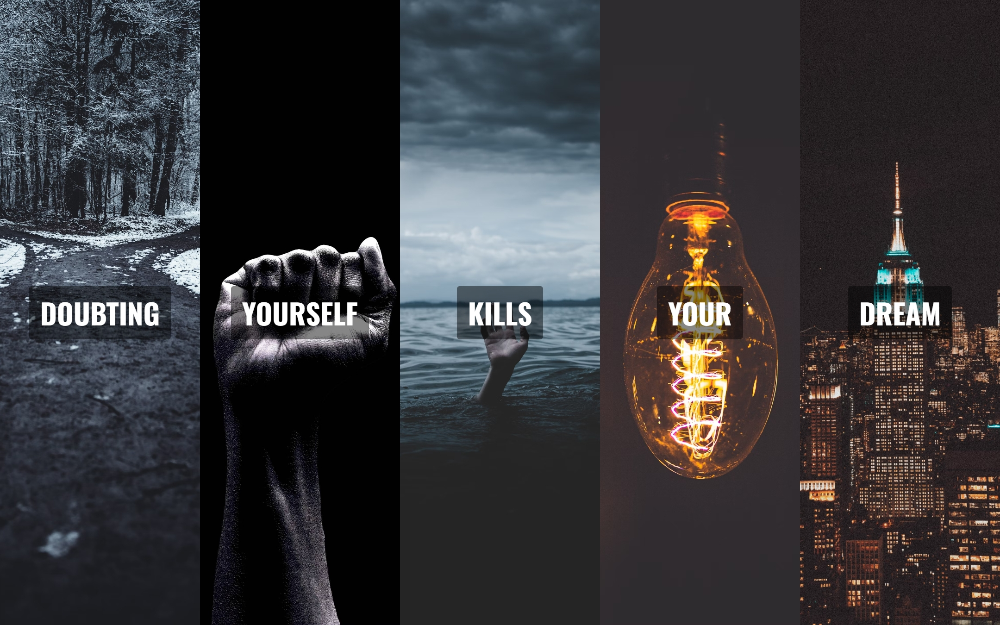

# Flexbox Panels Image Gallery

A visually engaging Flexbox-based gallery that displays motivational quotes with interactive panel animations. This project is designed to inspire personal growth and confidence through motivational imagery and quotes.

## Description

This project showcases a set of Flexbox panels that reveal motivational quotes with smooth transitions when clicked. Each panel is backed by an inspirational image and contains a highlighted quote. As the user interacts with the panels, the font size and layout change dynamically, providing a modern, visually appealing experience. The gallery is built using HTML, CSS, and JavaScript, making use of Flexbox and CSS transitions for responsiveness and interactivity.

## Features

- Motivational quotes displayed in a responsive Flexbox-based grid.
- Interactive panel transitions with smooth animations when clicked.
- Dynamic font size adjustments for responsive design using `clamp()`.
- Background images for each panel, carefully positioned to enhance the visual experience.
- Highlighted text for emphasis on specific motivational words.
- Built with modern CSS practices like Flexbox, transitions, and custom properties (CSS variables).
- JavaScript to manage panel interactions and trigger animations.

## Technologies Used

- HTML
- CSS
- JavaScript

## How to Run

1. Clone the repository to your local machine.
2. Open `index.html` in your web browser.
3. Alternatively, you can view the live project on GitHub Pages: [Flex Panels Image Gallery on GitHub Pages](https://deannamandarino.github.io/flexbox-panels-image-gallery/).

## Acknowledgments

This project was completed as part of the JavaScript30 course. Special thanks to Wes Bos for the excellent resources and guidance throughout the course.